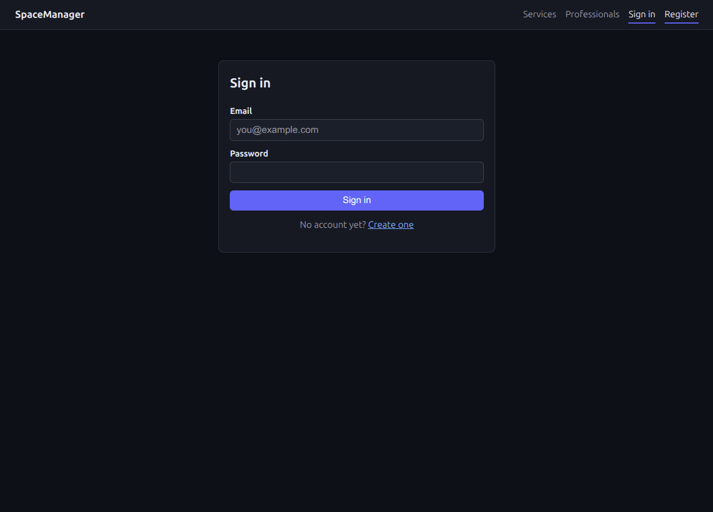
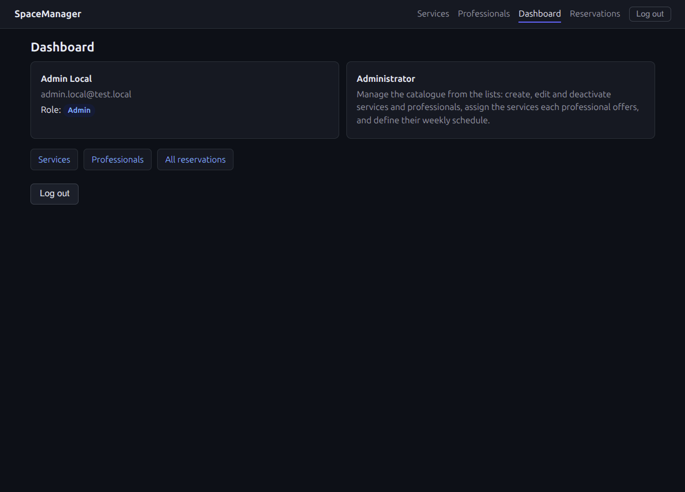
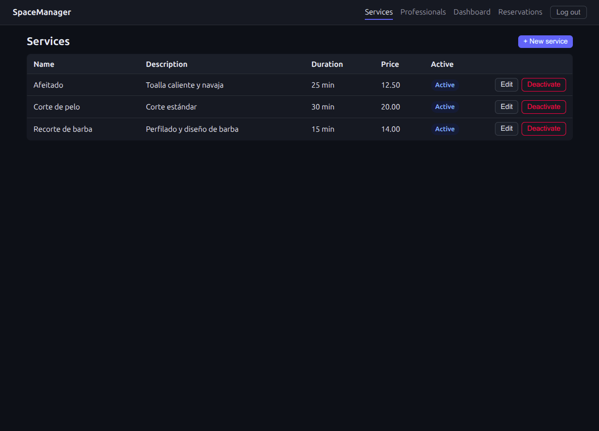
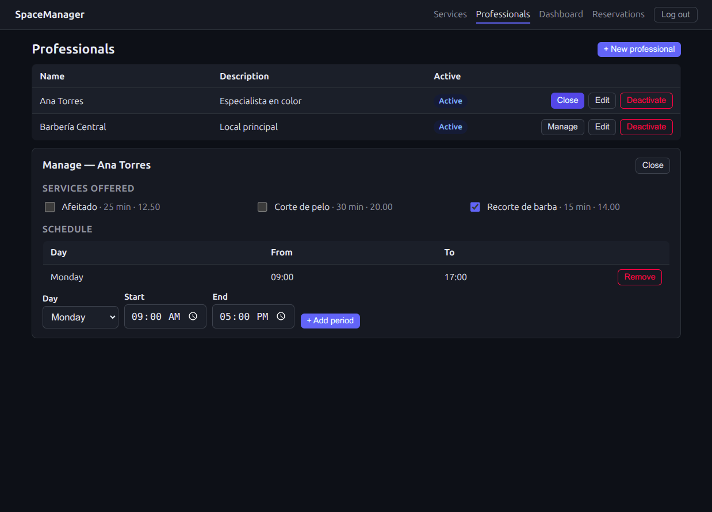
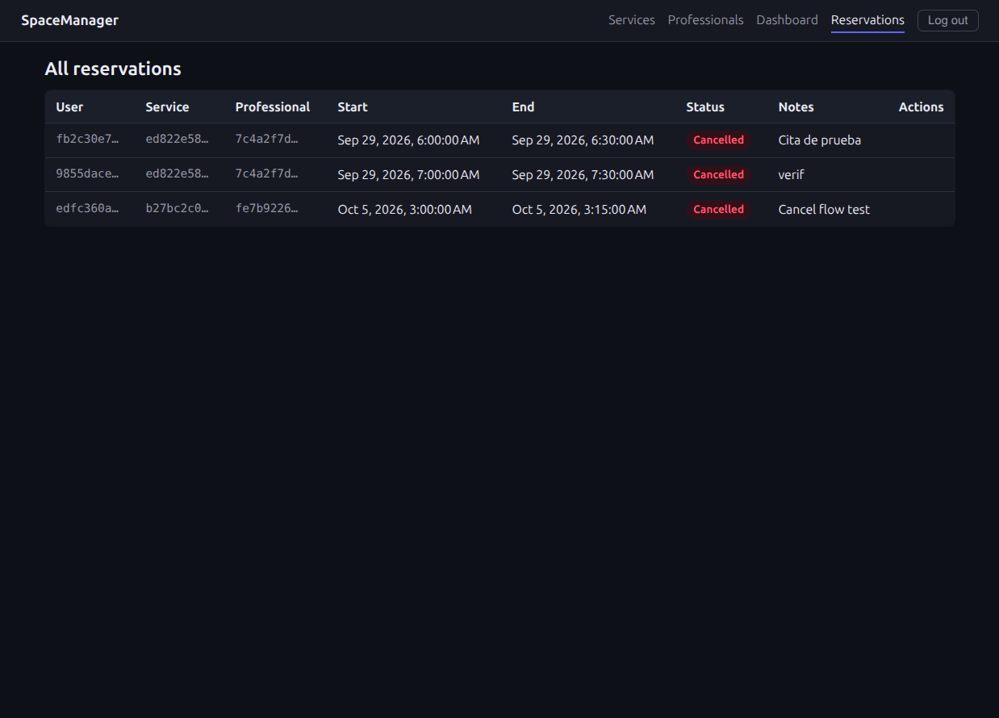
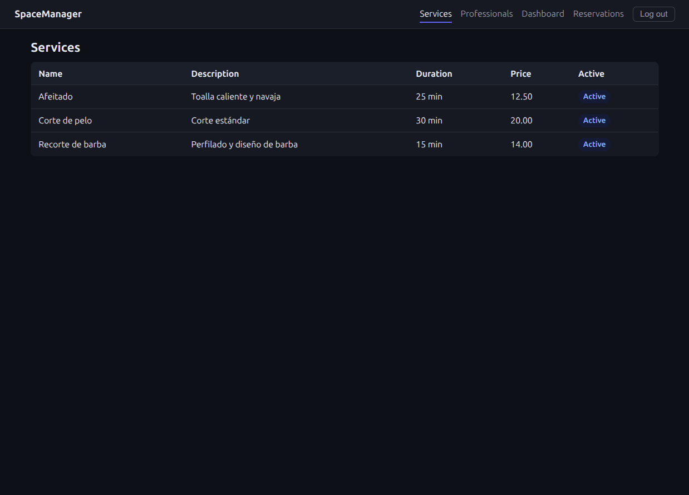

# Sistema de Reservas

[](https://github.com/CristiamSanchez/SpaceManager/actions/workflows/ci.yml)
[](https://github.com/CristiamSanchez/SpaceManager/actions/workflows/deploy-pages.yml)

**Demo (GitHub Pages):** https://cristiamsanchez.github.io/SpaceManager/ — la interfaz está desplegada; los datos requieren la API ejecutándose en local (ver [Frontend](#frontend)).

## 1. Descripción

Sistema web de reservas desarrollado con ASP.NET Core, utilizando Clean Architecture.

El sistema permitirá gestionar usuarios, servicios, profesionales, horarios y reservas.

El objetivo principal del proyecto es construir una aplicación pequeña pero completa que permita practicar conceptos utilizados habitualmente en proyectos profesionales de .NET.

---

## 2. Objetivos

El proyecto busca practicar:

* Clean Architecture
* ASP.NET Core
* Minimal APIs
* Entity Framework Core
* PostgreSQL
* Docker
* JWT Authentication
* Autorización basada en roles
* Validaciones
* Manejo de errores
* Relaciones entre entidades
* Persistencia de datos
* Unit Testing
* Integration Testing
* CI/CD

El proyecto debe mantenerse deliberadamente pequeño y comprensible.

No se deben agregar funcionalidades que no sean necesarias para el objetivo actual.

---

## 3. Arquitectura

El proyecto utilizará Clean Architecture.

### Capas

```text
Reservation.Api
        ↓
Reservation.Application
        ↓
Reservation.Domain

Reservation.Infrastructure
        ↓
Reservation.Application
        ↓
Reservation.Domain
```

La regla principal de dependencias es:

```text
Domain
  ↑
Application
  ↑
Infrastructure

Api → Application
Api → Infrastructure
```

### Domain

Contiene las reglas y conceptos principales del negocio.

No debe depender de:

* ASP.NET Core
* Entity Framework Core
* PostgreSQL
* Infrastructure
* Api

### Application

Contiene los casos de uso de la aplicación.

Ejemplos:

* Crear reserva
* Cancelar reserva
* Crear servicio
* Consultar disponibilidad

### Infrastructure

Contiene implementaciones técnicas.

Ejemplos:

* Entity Framework Core
* DbContext
* PostgreSQL
* Implementaciones de repositorios
* Servicios externos

### Api

Contiene la entrada HTTP de la aplicación.

Incluye:

* Endpoints
* Configuración
* Authentication
* Authorization
* Dependency Injection

---

## 4. Funcionalidades

### Usuarios

* Registro
* Login
* Autenticación mediante JWT
* Roles

Roles iniciales:

* Admin
* Client

### Servicios

* Crear servicio
* Consultar servicios
* Actualizar servicio
* Activar/desactivar servicio

### Profesionales

* Crear profesional
* Consultar profesionales
* Asociar servicios
* Activar/desactivar profesional

### Horarios

* Configurar disponibilidad
* Definir días de trabajo
* Definir horarios

### Reservas

* Crear reserva
* Consultar reservas
* Cancelar reserva
* Validar disponibilidad
* Evitar reservas duplicadas

---

## 5. Tecnologías

* .NET 10
* ASP.NET Core
* Minimal APIs
* Entity Framework Core
* PostgreSQL
* Docker
* JWT
* xUnit
* Git
* GitHub Actions

Las versiones exactas de paquetes deben mantenerse actualizadas y ser compatibles con la versión del SDK utilizada por el proyecto.

---

## 6. Reglas de desarrollo

### Regla 1 — Clean Architecture

Todas las funcionalidades deben respetar la separación de responsabilidades definida por la arquitectura.

### Regla 2 — Domain independiente

Domain no debe depender de Infrastructure ni de Api.

### Regla 3 — No sobreingeniería

No agregar patrones, librerías o abstracciones que no aporten valor al proyecto actual.

### Regla 4 — Revisar antes de modificar

Antes de crear o modificar código, se debe revisar la estructura y el código existente relacionado con la tarea.

No se debe recrear código que ya existe.

### Regla 5 — Cambios pequeños

Cada fase debe realizar cambios pequeños y verificables.

### Regla 6 — Compilar después de cambios importantes

Después de implementar una fase se debe ejecutar la compilación y las pruebas correspondientes.

### Regla 7 — No modificar código sin necesidad

Si una funcionalidad existente ya cumple correctamente con el requisito, debe reutilizarse.

### Regla 8 — Mantener consistencia

Antes de introducir una nueva forma de resolver un problema, revisar cómo se resolvió anteriormente.

---

## 7. Flujo de desarrollo

El proyecto se desarrollará por fases.

Cada fase debe:

1. Revisar el estado actual del proyecto.
2. Identificar qué ya existe.
3. Implementar únicamente lo necesario.
4. Compilar.
5. Ejecutar pruebas relacionadas.
6. Corregir errores.
7. Documentar el resultado.
8. Actualizar el estado del proyecto.

No se debe implementar una fase posterior si depende de una fase anterior que todavía está incompleta.

---

## 8. Fases

### Fase 0

Definición y estructura inicial.

### Fase 1

Creación de la solución y proyectos Clean Architecture.

### Fase 2

Domain.

### Fase 3

Application.

### Fase 4

Infrastructure y PostgreSQL.

### Fase 5

API y Dependency Injection.

### Fase 6

CRUD de servicios.

### Fase 7

Usuarios y autenticación JWT.

### Fase 8

Roles y autorización.

### Fase 9

Profesionales.

### Fase 10

Horarios y disponibilidad.

### Fase 11

Reservas.

### Fase 12

Validaciones y manejo de errores.

### Fase 13

Tests.

### Fase 14

Docker.

### Fase 15

Git/GitHub: repositorio inicializado con `.gitignore` y baseline único en `main`.

### Fase 16

Frontend Angular (`src/SpaceManager.Web`).

### Fase 17

Frontend: administración CRUD (servicios, profesionales, disponibilidad y reservas) y tema oscuro.

### Fase 18

CI con GitHub Actions (build + test).

### Fase 19

Despliegue de la interfaz en GitHub Pages.

### Fase 20

Revisión final y cierre del proyecto.

---

## 9. Regla para agentes de IA

Los agentes de IA utilizados para desarrollar este proyecto deben:

1. Leer este README antes de comenzar una nueva fase.
2. Revisar el código existente relacionado con la tarea.
3. No recrear funcionalidades existentes.
4. No modificar archivos no relacionados con la tarea.
5. No introducir dependencias innecesarias.
6. Mantener Clean Architecture.
7. Mantener las convenciones existentes del proyecto.
8. Compilar y probar después de cambios importantes.
9. Explicar brevemente los cambios realizados.
10. Detenerse cuando la fase solicitada esté terminada.

El agente no debe implementar fases futuras salvo que se solicite explícitamente.

---

## 10. Estado del proyecto

| Fase               | Estado    |
| ------------------ | --------- |
| 0. Definición      | Completada |
| 1. Estructura      | Completada |
| 2. Domain          | Completada |
| 3. Application     | Completada |
| 4. Infrastructure  | Completada |
| 5. API             | Completada |
| 6. Servicios       | Completada |
| 7. JWT             | Completada |
| 8. Roles           | Completada |
| 9. Profesionales   | Completada |
| 10. Horarios       | Completada |
| 11. Reservas       | Completada |
| 12. Validaciones   | Completada |
| 13. Tests          | Completada |
| 14. Docker         | Completada |
| 15. Git/GitHub     | Completada |
| 16. Frontend       | Completada |
| 17. Admin y oscuro | Completada |
| 18. CI/CD          | Completada |
| 19. GitHub Pages   | Completada |
| 20. Revisión final | Completada |

### Ejecución local (Docker + PostgreSQL)

1. Crear un `.env` en la raíz (ignorado por `.gitignore`) con `POSTGRES_PASSWORD=<tu-password-local>` — docker compose lo lee automáticamente.
2. `docker compose up -d` → PostgreSQL 17 queda en `localhost:5435` (el mapeo de host es 5435 porque los puertos 5432–5434 están ocupados por contenedores ajenos; dentro de la red Docker sigue en 5432).
3. Aplicar la migración (una sola vez):

   ```bash
   ConnectionStrings__Postgres="Host=localhost;Port=5435;Database=reservation_db;Username=reservation_user;Password=<tu-password-local>" \
     dotnet ef database update --project src/Reservation.Infrastructure --startup-project src/Reservation.Api
   ```

4. Arrancar la API con la misma variable `ConnectionStrings__Postgres`: `dotnet run --project src/Reservation.Api` → `http://localhost:5163`.
5. Tests: `dotnet test`.

El password real vive solo en `.env`/variables de entorno: `appsettings.json` conserva el placeholder `CHANGE_ME` y no debe modificarse. El secreto JWT de desarrollo es un placeholder; en producción se sustituye por `Jwt__SecretKey`. Para crear un Admin en desarrollo, regístralo por la API y promóvelo con SQL directo en el contenedor (procedimiento exacto en `docs/project-state.md`, Fase 14).

---

## Frontend

La aplicación Angular vive en [`src/SpaceManager.Web`](src/SpaceManager.Web) y consume `Reservation.Api` (`http://localhost:5163`).

- Angular 22 con standalone components, Router, HttpClient (interceptor JWT) y Reactive Forms. Sin librerías de UI ni de estado global (sin Material/PrimeNG/Tailwind/NgRx); la única configuración de entorno es `environment.apiUrl` y no hay secretos en el frontend.
- **Tema oscuro** (`styles.css` con variables CSS y `color-scheme: dark`) con layout compacto.
- Rutas públicas: `/login`, `/register`, `/services`, `/professionals`. Rutas protegidas: `/dashboard`, `/reservations` (redirigen a `/login` si no hay JWT).
- **Administración:** con rol `Admin`, la lista de servicios y la de profesionales habilitan alta, edición y activación/desactivación; el botón **Manage** de cada profesional permite asignarle servicios y administrar su disponibilidad semanal. En reservas, el Admin ve todas con columnas de usuario/servicio/profesional y puede cancelar. El cliente mantiene una vista de solo lectura ("My reservations"). El backend vuelve a validar cada operación (401/403).
- Ejecución local, con la API y PostgreSQL en marcha:

  ```bash
  cd src/SpaceManager.Web
  npm install
  npm start    # http://localhost:4200
  ```

La API permite en desarrollo el origen `http://localhost:4200` mediante una política CORS explícita de solo desarrollo en `Program.cs` (nunca `AllowAnyOrigin` con credenciales ni una política amplia de producción).

### Demo desplegado (GitHub Pages)

En cada `push` a `main`, `.github/workflows/deploy-pages.yml` compila el frontend (con `--base-href /SpaceManager/`) y lo despliega en **https://cristiamsanchez.github.io/SpaceManager/**.

- El demo es **estático**: no hay API hospedada, así que `environment.apiUrl` apunta a `http://localhost:5163` y en Pages las llamadas de datos muestran "Cannot reach the server. Is the API running?".
- Para probar la funcionalidad completa, ejecuta la API en local (ver [Ejecución local](#ejecución-local-docker--postgresql)) y el frontend con `npm start`.
- GitHub Pages no reescribe rutas SPA: `public/404.html` redirige las rutas profundas al root, donde el router resuelve la página (la sesión se conserva en `localStorage`).

### Capturas de pantalla

| | |
| --- | --- |
| **Inicio de sesión**<br> | **Dashboard (Admin)**<br> |
| **Servicios — vista Admin**<br> | **Profesional — panel Manage**<br> |
| **Reservas — vista Admin**<br> | **Servicios — vista Cliente**<br> |

### Credenciales de desarrollo

Para probar la interfaz (no almacenadas en el repositorio; la base local las crea el propio proceso de desarrollo):

- Admin: `admin.local@test.local` — ver `docs/project-state.md` (Fase 14: promoción de rol por SQL directo) para el procedimiento de creación.
- Cualquier usuario registrado con rol `Client` ve la interfaz de solo lectura.

Rol	Email	Password
Admin	admin.local@test.local	DevSmoke!2026x
Client	cliente.local@test.local	DevSmoke!2026x
